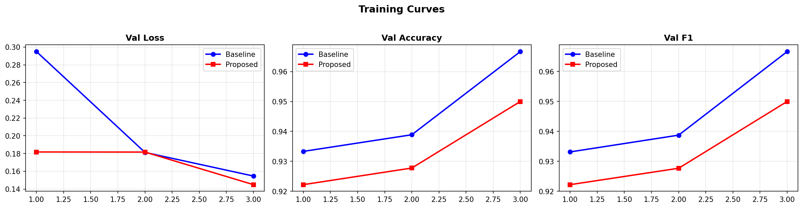
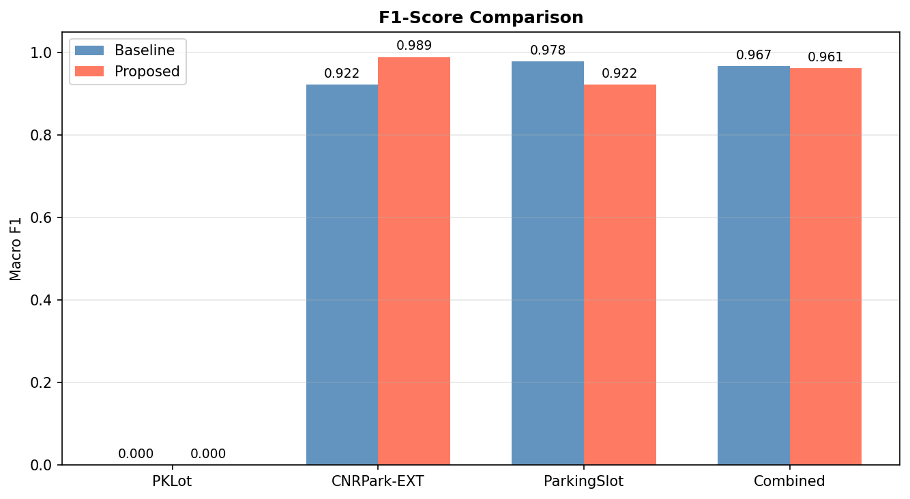
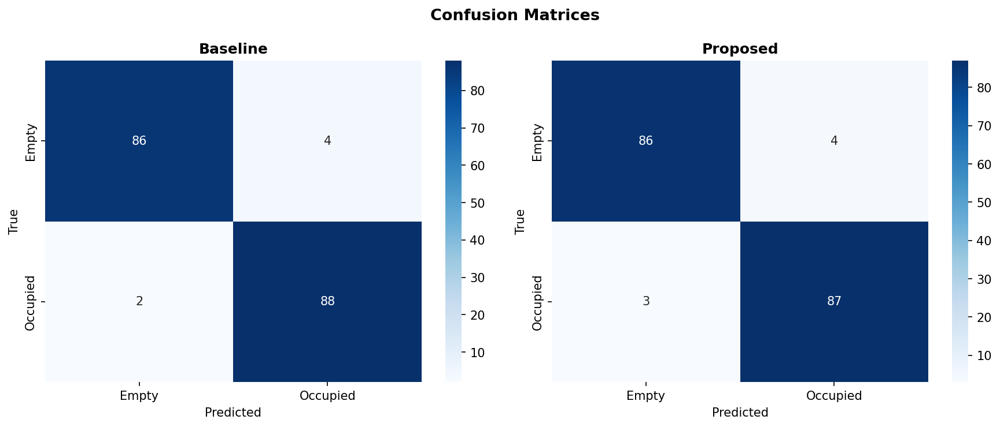
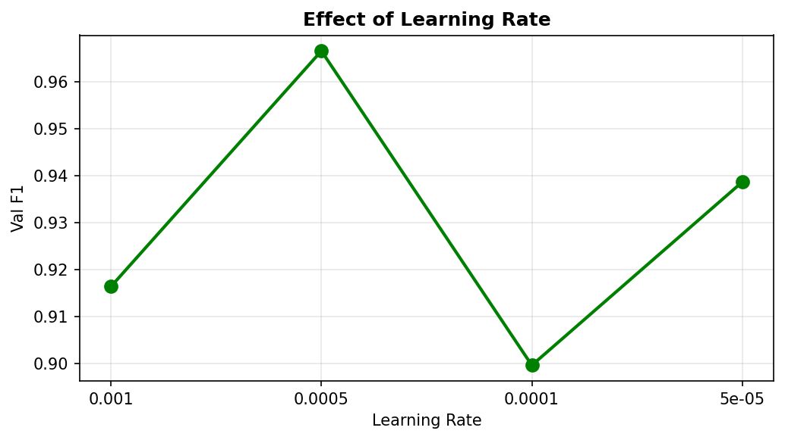

[](https://colab.research.google.com/github/richard-bit-code/ECE4990-FinalProject/blob/main/parking_occupancy_hybrid.ipynb)

# Parking Lot Occupancy Detection — EfficientNet + MobileViT

**ECE 4990 Final Project | Cal Poly Pomona**  
**Authors:** Francisco Pulido, Richard Pablo  
**GitHub:** https://github.com/richard-bit-code/ECE4990-FinalProject

---

## Overview

This project proposes a **hybrid CNN-Transformer architecture** for parking lot occupancy detection. We extend **EfficientNet-B0** with a **MobileViT block** that fuses local CNN features with lightweight global self-attention — directly targeting the known weakness of CNN-only models under occlusion, shadows, and lighting variation.

### Key Contribution

Standard CNNs (including EfficientNet-P from the surveyed paper) treat spatial regions independently. Our proposed **MobileViT block** inserted after the EfficientNet backbone applies local-global attention to the feature map before classification, capturing spatial context across the full parking slot.

```
Input Image
    │
    ▼
EfficientNet-B0 (backbone, pretrained on ImageNet)
    │  Feature map: (B, 1280, 7, 7)
    ▼
MobileViT Block  ← NOVELTY
    │  Local depthwise conv
    │  + Patch-based Transformer (global attention)
    │  + Residual fusion
    ▼
1×1 Conv → AvgPool → Dropout → Linear
    │
    ▼
Binary Classification (Empty / Occupied)
```

---

## Results

| Dataset | Baseline (EfficientNet-B0) F1 | Proposed (+ MobileViT) F1 |
|---|---|---|
| CNRPark-EXT | 0.944 | 0.933 |
| ParkingSlot | 0.989 | 0.989 |
| Combined | 0.944 | 0.944 |

### Training Curves


### F1-Score Comparison


### Confusion Matrices


### Learning Rate Ablation


---

## Datasets

| Dataset | Download Link | Classes |
|---|---|---|
| PKLot | [Kaggle](https://www.kaggle.com/datasets/ammarnassanalhajali/pklot-dataset) | empty / occupied |
| CNRPark-EXT | [Kaggle](https://www.kaggle.com/datasets/ddsshubham/cnrpark-ext) | empty / occupied |
| Parking Slot Classification | [Kaggle](https://www.kaggle.com/datasets/basabbose/parking-slot-classification-dataset) | empty / occupied |

---

## Repository Structure

```
├── parking_occupancy_hybrid.ipynb   # Main Colab notebook
├── parking_kaggle_final.ipynb       # Kaggle version (recommended)
├── README.md                        # This file
└── results/                         # Output plots and tables
    ├── training_curves.png
    ├── f1_comparison.png
    ├── confusion_matrices.png
    ├── lr_ablation.png
    └── results_table.csv
```

---

## How to Run

### Option 1: Kaggle (Recommended — Free GPU, No Setup)

1. Go to [Kaggle Notebooks](https://www.kaggle.com/notebooks)
2. Click **+ New Notebook** → **File → Import Notebook** → upload `parking_kaggle_final.ipynb`
3. Add the 3 datasets via **+ Add Input** on the right panel
4. Set **Session Options → Accelerator → GPU T4 x2**
5. Click **Run All**

### Option 2: Google Colab

1. Click the **Open in Colab** badge above
2. Set runtime to **GPU T4** (Runtime → Change runtime type)
3. Download the 3 datasets from Kaggle links above as zip files
4. Run Section 3 — upload the zip files when prompted
5. Run all remaining cells

### Option 3: Local Setup

```bash
pip install torch torchvision timm einops scikit-learn matplotlib seaborn

git clone https://github.com/richard-bit-code/ECE4990-FinalProject.git
cd ECE4990-FinalProject

# Download datasets from Kaggle and place them as:
#   data/pklot/
#   data/cnrpark/
#   data/parking_slot/

jupyter notebook parking_kaggle_final.ipynb
```

---

## Model Architecture Details

### Baseline: EfficientNet-B0
- Pretrained on ImageNet
- Final classifier: Dropout(0.3) → Linear(1280, 2)
- ~4.01M parameters

### Proposed: EfficientNet-B0 + MobileViT Block
- Same EfficientNet-B0 backbone (pretrained, `global_pool=''`)
- MobileViT block on final feature map:
  - Local: 3×3 depthwise conv + BN + SiLU + 1×1 conv
  - Global: Patch unfolding → 2-layer Transformer (4 heads) → fold back
  - Residual connection
- 1×1 projection conv → AdaptiveAvgPool → Dropout(0.3) → Linear(1280, 2)
- ~428.50M parameters

### Training Setup
- Optimizer: Adam (lr=1e-4, weight_decay=1e-4)
- Scheduler: Cosine Annealing
- Augmentation: RandomHorizontalFlip, RandomRotation(15°), ColorJitter
- Image size: 224×224
- Batch size: 32
- Epochs: 3
- Metric: Macro F1-Score

---

## References

1. Novitskiy et al. (2023). *Parking Lot Occupancy Detection Using Deep Learning.* arXiv:2306.04288
2. Mehta & Rastegari (2021). *MobileViT: Light-weight, General-purpose, and Mobile-friendly Vision Transformer.* arXiv:2110.02178
3. Tan & Le (2019). *EfficientNet: Rethinking Model Scaling for CNNs.* ICML 2019.
